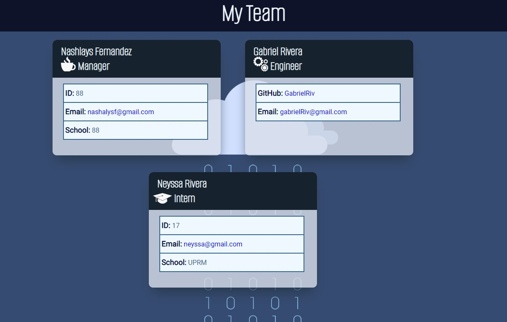

# Team-card-generator
   - A Node.js command-line team profile generator. Users enter general information about their employees so that it can generate a styled HTML page.
   The HTML can be viewed at this [link](Team Profile (nashalysf.github.io)).

   

   ## Table of Contents
   - [Languages](#laguages)
   - [Installation](#installation)
   - [Usage](#usage)
   - [Test](#test)
   - [Contribution](#contribution)
   - [Contact](#contact)

   ## Languages
   JavaScript, Node

   ## Installation
   To install, on `Code` clone repo SSH link and on command-line type `git clone [insert link]`. Once installed along with `Node.js` and `Inquirer`, open you IDE of chosing and on the command-line type `node index`.

   ## Usage
   Onced installed and `node index` command running, the user will answer a set of questions starting with the project manager. If more employees are going to be added, choose the type of role they play and answer the same set of questions.

   ## Test
   You may see this [video](https://drive.google.com/file/d/19jDpMd-rQfQpCtERmcXd-KeHXceo0qb2/view) for visual usage instructions.

   ## Contributions
   To contribute clone the code, create a branch and request a push to optimize code and user experience.

   ## Contact
   * Email: [nashalysf@gmail.com](mailto:nashalysf@gmail.com)
   